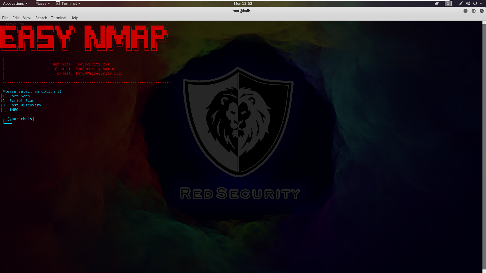

# easy-nmap
This tool makes using nmap easier
## installation
Just run the following commands to install
```
git clone https://github.com/RedSecurity/easy-nmap.git
cd easy-nmap
bash installer.sh
cd -
```
## Usage
Just run the following command
```
easy-nmap
```
You can run the above command anywhere in terminal
## ScreenShot

## Contact us
WebSite: redsecurity.xyz
Email: info@redsecurity.xyz
